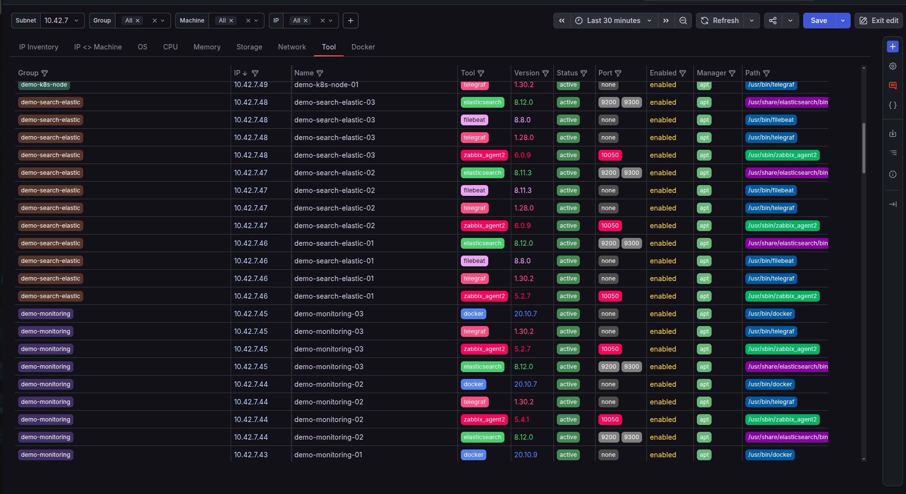
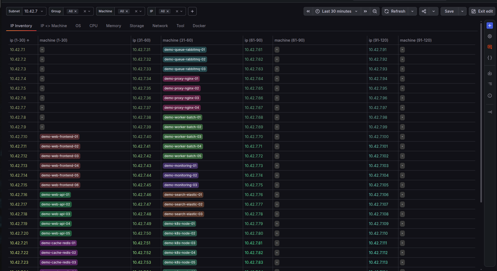

# Auto-Doc

Auto-Doc is an Ansible playbook that discovers your servers and documents them automatically. It scans a subnet, finds every reachable machine, and writes out flat JSON files describing each one's OS, CPU, memory, storage, network, installed tools, Docker containers, and IPs.



*Every host, every tool, every version — one table. (Screenshot is running against the sample data in `examples/outputs/`, not a real fleet.)*

## Features

- **Auto-discovery** — give it subnets, it finds the machines. No inventory file to maintain by hand.
- **Naming-agnostic grouping** — machines are grouped by stripping the trailing number off their hostname (e.g. `redis-01`, `redis-02` → group `redis`). No hardcoded role list to update.
- **Correct static IP detection** — if a machine answers on more than one IP (a real static IP plus a floating one), Auto-Doc figures out which is the real one using netplan config, falling back to the default route, and flags anything it had to guess.
- **One-run convergence** — discovery and documentation happen in a single `ansible-playbook` command. No second run needed to pick up new machines.
- **Zero-footprint** — target machines need nothing but SSH and a shell. No Python, no agents.
- **Read-only** — never modifies target machines. Only reads (`cat`, `grep`, `df`, `lsblk`, etc.).
- **One file per topic** — each component (`os`, `cpu`, `docker`, ...) is its own task and its own output file, so you can add or update one without touching the rest.
- **Consistent, sorted output** — every JSON file uses the same `<component>_<field>` naming, and hosts are listed in IP order.
- **Grafana-ready** — the `outputs/` folder is plain JSON, served over HTTP by the bundled `docker-compose.yml` and built to be queried directly with Grafana's Infinity datasource.

## Try it in 60 seconds (no servers needed)

Want to see the dashboard before pointing this at real infrastructure? The repo ships with fake sample data in `examples/outputs/` — 45 fictional hosts across 10 groups, same schema the playbook actually produces.

```bash
cp examples/outputs/*.json outputs/
docker compose up -d
```

Then import `dashboard.json` into Grafana. You'll get the fully populated view above, no SSH access or subnets required. The dashboard's color-coding (per-group, per-tool-image, per-container) is pre-wired to this sample data's naming — swap in your own fleet's `outputs/` later and re-color as you like.

## Project structure

```
.
├── main.yaml               # runs discovery, then all the collectors
├── ansible.cfg              # points the default inventory at hosts.yaml
├── hosts.yaml               # output record only, not read as input
├── docker-compose.yml       # serves outputs/ over HTTP for Grafana
├── dashboard.json            # ready-made Grafana dashboard (import as-is)
├── tasks/
│   ├── discover.yaml        # finds machines, resolves their static IP
│   ├── os.yaml
│   ├── cpu.yaml
│   ├── memory.yaml
│   ├── storage.yaml
│   ├── network.yaml
│   ├── tools.yaml
│   ├── docker.yaml
│   └── ip-inventory.yaml
├── examples/
│   └── outputs/              # fake sample data — see "Try it in 60 seconds"
├── docs/
│   └── screenshots/
├── json-exposer/             # tiny Go static-file server, built locally by docker-compose
│   ├── main.go
│   └── Dockerfile
└── outputs/                   # real playbook output — gitignored, never committed
    ├── os.json
    ├── cpu.json
    └── ...
```

## Running it

```bash
ansible-playbook main.yaml
```

That's it — no `-i` flag needed. Subnets are set in the `subnets` var at the top of `main.yaml`.

What happens:
1. `discover` scans those subnets, SSHes into whatever it finds, and figures out each machine's hostname, group, and real static IP.
2. Those machines are used immediately by the rest of the same run — `os`, `cpu`, `memory`, `storage`, `network`, `tools`, `docker`, `ip-inventory` — each writing its own file to `outputs/`.

`outputs/` is gitignored on purpose — it's your real fleet's data (hostnames, IPs, installed tool versions). Don't commit it.

## Viewing it in Grafana

```bash
docker compose up -d
```

This builds `json-exposer` — a ~60-line, dependency-free Go server vendored in `json-exposer/` — and serves `outputs/` over HTTP on port `8080`, which is what Grafana's Infinity datasource queries. Import `dashboard.json` into Grafana to get a ready-made view — no panels to build from scratch.



## Prerequisites

- **SSH key-based root access** to every target machine.
- **`ansible` and `jq`** installed on the control node.

## Adding a new field

1. Pick the right task file (or create a new one in `tasks/`).
2. Add a short raw shell command that reads the value.
3. Prefix the field with `<component>_`, e.g. `cpu_physical_cores`.
4. Check `outputs/` first to make sure the field name isn't already used.

## Why not NetBox or a spreadsheet?

- No database, no UI to configure.
- Adding a field is a 3-line shell command, not a migration.
- Output is plain JSON — easy to convert to CSV, SQL, or a report.
- Sits right next to your Grafana dashboards, on the same IP/hostname keys.
